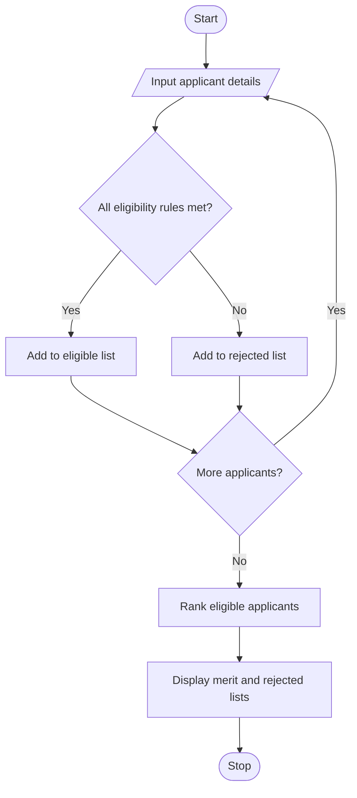

# Flowchart – Case Study 1

```mermaid
flowchart TD
 A([Start]) --> B[/Input applicant details/]
 B --> C{All eligibility rules met?}
 C -- Yes --> D[Add to eligible list]
 C -- No --> E[Add to rejected list]
 D --> F{More applicants?}
 E --> F
 F -- Yes --> B
 F -- No --> G[Rank eligible applicants]
 G --> H[Display merit and rejected lists]
 H --> I([Stop])
```
