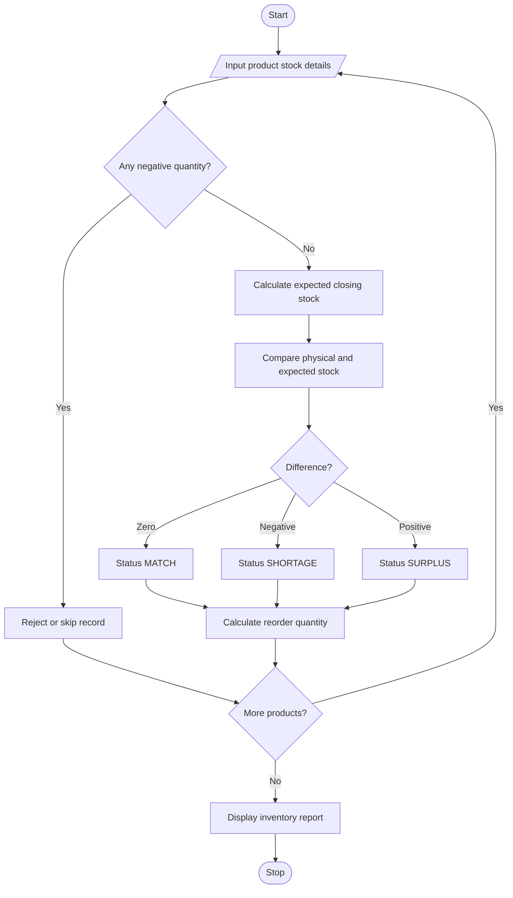

# Flowchart – Case Study 2

This flowchart is provided in two viewable forms: the rendered PNG below and the editable Mermaid diagram source.

## Mermaid source

```mermaid
flowchart TD
 A([Start]) --> B[/Input product stock details/]
 B --> C{Any negative quantity?}
 C -- Yes --> D[Reject or skip record]
 C -- No --> E[Calculate expected closing stock]
 E --> F[Compare physical and expected stock]
 F --> G{Difference?}
 G -- Zero --> H[Status MATCH]
 G -- Negative --> I[Status SHORTAGE]
 G -- Positive --> J[Status SURPLUS]
 H --> K[Calculate reorder quantity]
 I --> K
 J --> K
 D --> L{More products?}
 K --> L
 L -- Yes --> B
 L -- No --> M[Display inventory report]
 M --> N([Stop])
```
