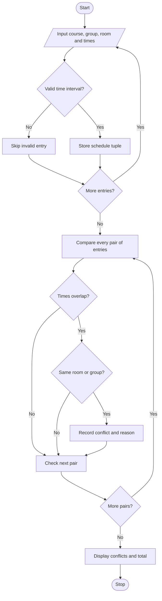

# Flowchart – Case Study 3

```mermaid
flowchart TD
 A([Start]) --> B[/Input course, group, room and times/]
 B --> C{Valid time interval?}
 C -- No --> D[Skip invalid entry]
 C -- Yes --> E[Store schedule tuple]
 D --> F{More entries?}
 E --> F
 F -- Yes --> B
 F -- No --> G[Compare every pair of entries]
 G --> H{Times overlap?}
 H -- No --> I[Check next pair]
 H -- Yes --> J{Same room or group?}
 J -- Yes --> K[Record conflict and reason]
 J -- No --> I
 K --> I
 I --> L{More pairs?}
 L -- Yes --> G
 L -- No --> M[Display conflicts and total]
 M --> N([Stop])
```
