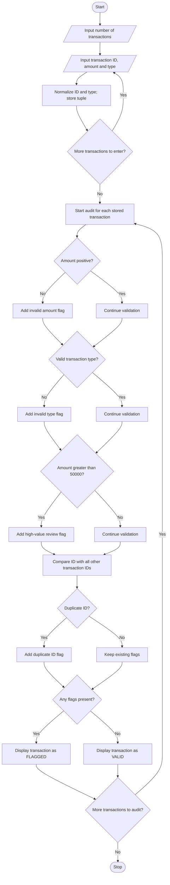

# Flowchart – Tuple-Based Transaction Audit

```mermaid
flowchart TD
 A([Start]) --> B[/Input number of transactions/]
 B --> C[/Input transaction ID, amount and type/]
 C --> D[Normalize ID and type; store tuple]
 D --> E{More transactions to enter?}
 E -- Yes --> C
 E -- No --> F[Start audit for each stored transaction]
 F --> G{Amount positive?}
 G -- No --> H[Add invalid amount flag]
 G -- Yes --> I[Continue validation]
 H --> J{Valid transaction type?}
 I --> J
 J -- No --> K[Add invalid type flag]
 J -- Yes --> L[Continue validation]
 K --> M{Amount greater than 50000?}
 L --> M
 M -- Yes --> N[Add high-value review flag]
 M -- No --> O[Continue validation]
 N --> P[Compare ID with all other transaction IDs]
 O --> P
 P --> Q{Duplicate ID?}
 Q -- Yes --> R[Add duplicate ID flag]
 Q -- No --> S[Keep existing flags]
 R --> T{Any flags present?}
 S --> T
 T -- Yes --> U[Display transaction as FLAGGED]
 T -- No --> V[Display transaction as VALID]
 U --> W{More transactions to audit?}
 V --> W
 W -- Yes --> F
 W -- No --> X([Stop])
```
