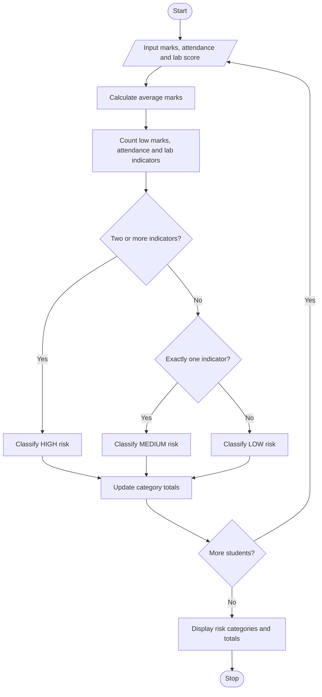

# Flowchart – Case Study 6

```mermaid
flowchart TD
 A([Start]) --> B[/Input marks, attendance and lab score/]
 B --> C[Calculate average marks]
 C --> D[Count low marks, attendance and lab indicators]
 D --> E{Two or more indicators?}
 E -- Yes --> F[Classify HIGH risk]
 E -- No --> G{Exactly one indicator?}
 G -- Yes --> H[Classify MEDIUM risk]
 G -- No --> I[Classify LOW risk]
 F --> J[Update category totals]
 H --> J
 I --> J
 J --> K{More students?}
 K -- Yes --> B
 K -- No --> L[Display risk categories and totals]
 L --> M([Stop])
```
