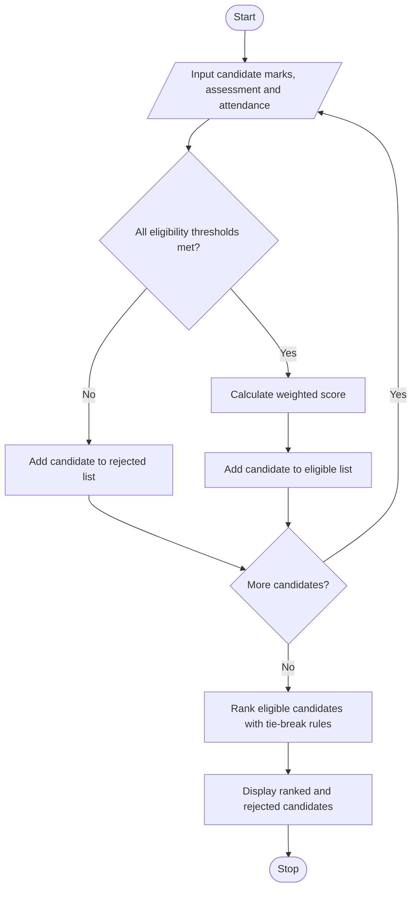

# Flowchart – Case Study 8

```mermaid
flowchart TD
 A([Start]) --> B[/Input candidate marks, assessment and attendance/]
 B --> C{All eligibility thresholds met?}
 C -- No --> D[Add candidate to rejected list]
 C -- Yes --> E[Calculate weighted score]
 E --> F[Add candidate to eligible list]
 D --> G{More candidates?}
 F --> G
 G -- Yes --> B
 G -- No --> H[Rank eligible candidates with tie-break rules]
 H --> I[Display ranked and rejected candidates]
 I --> J([Stop])
```
