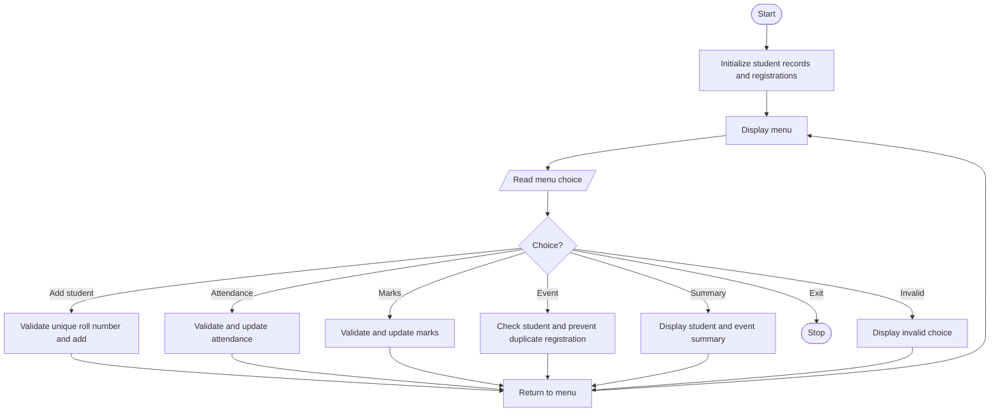

# Flowchart – Case Study 10

```mermaid
flowchart TD
 A([Start]) --> B[Initialize student records and registrations]
 B --> C[Display menu]
 C --> D[/Read menu choice/]
 D --> E{Choice?}
 E -- Add student --> F[Validate unique roll number and add]
 E -- Attendance --> G[Validate and update attendance]
 E -- Marks --> H[Validate and update marks]
 E -- Event --> I[Check student and prevent duplicate registration]
 E -- Summary --> J[Display student and event summary]
 E -- Exit --> K([Stop])
 E -- Invalid --> L[Display invalid choice]
 F --> M[Return to menu]
 G --> M
 H --> M
 I --> M
 J --> M
 L --> M
 M --> C
```
